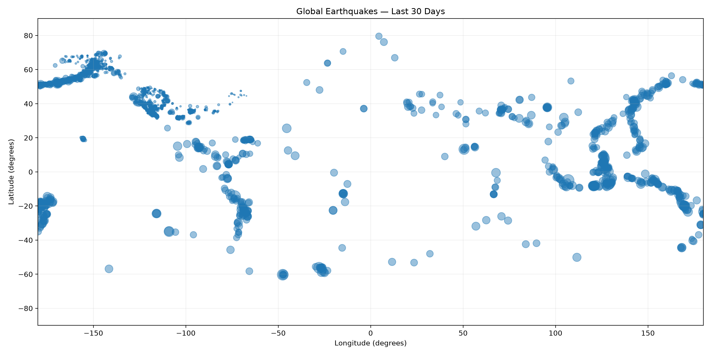

# Global Earthquakes in the Last 30 Days

## The phenomenon

Earthquakes happen when stress stored in the Earth's crust is suddenly released. They occur every day around the world, even when nobody nearby feels them. I chose earthquakes because the events are global and can be measured as both location and magnitude.

This project looks at earthquakes recorded by the USGS during the most recent 30-day period available when I fetched the data. Each earthquake has a geographic position and a magnitude, so I use a scatter plot: longitude and latitude show where earthquakes happened, while the size of each point represents its magnitude.

## The source

The data comes from the United States Geological Survey (USGS) Earthquake Hazards Program:

https://earthquake.usgs.gov/earthquakes/feed/

I used the USGS GeoJSON feed for all earthquakes in the past 30 days. The downloaded file is saved unchanged as `data/earthquakes.geojson`, so the plotting program does not need an internet connection.

The file contains one GeoJSON feature for each earthquake. Each feature includes its longitude, latitude, and magnitude. My downloaded file contains 11,037 earthquake records.

## The picture

## What the picture shows

The picture maps the earthquakes by longitude and latitude. Larger circles represent larger earthquake magnitudes, so the visual shows both the geographic distribution of earthquakes and the relative size of the events.

The picture hides the exact time of each earthquake and most of the other information supplied by USGS. It also does not show depth, so earthquakes at different depths can appear together at the same surface location.

## Run it

`uv run fetch.py`
`uv run plot.py`
